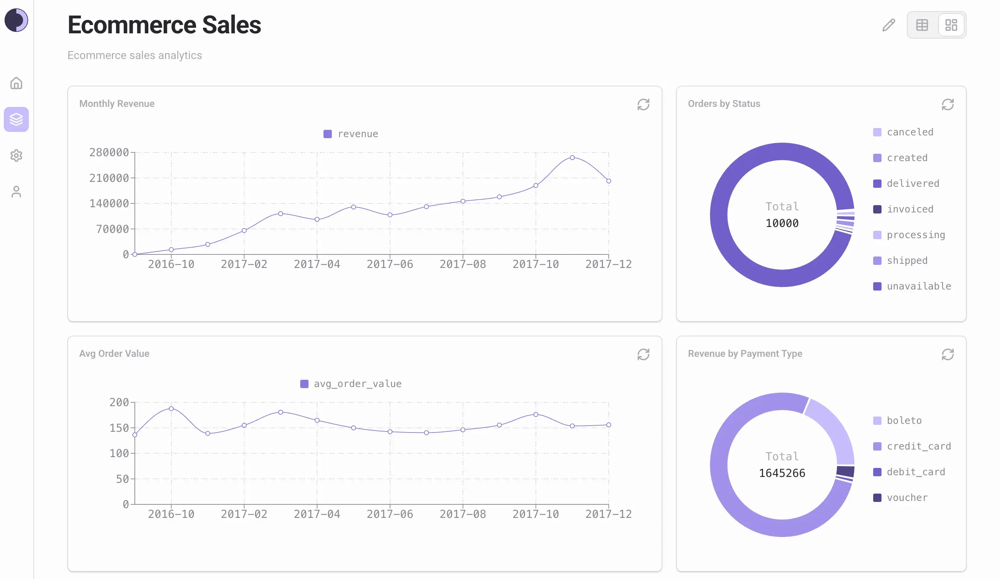

<div align="center">
  <a href="https://www.sopho.io">
    <picture>
      <source media="(prefers-color-scheme: dark)" srcset="assets/sopho-logo-with-name-dark.svg">
      
    </picture>
  </a>
</div>

<h3 align="center">
  Open Source Business Intelligence
</h3>

<p align="center">
  <a href="https://github.com/sopho-tech/sopho/pkgs/container/sopho%2Fsopho">
    
  </a>
  <a href="https://github.com/sopho-tech/sopho/blob/main/LICENSE">
    
  </a>
  <a href="https://github.com/sopho-tech/sopho/stargazers">
    
  </a>
</p>



## Description

Sopho is an open source Business Intelligence (BI) platform rethought from scratch to be simple, performant, secure and AI-native.

## Features

### Beautiful

Sopho is designed to be beautiful and intuitive. Sopho strives to be the best quality product in its category. Deeply inspired by [Conversations on Quality](https://linear.app/quality).

### Integrated Notebook and Dashboard

You no longer have to move between different SQL queries, charts, and dashboards open in different browser tabs to explore data and to create your dashboards. Sopho simplifies this by putting everything in one place using a new abstraction called Canvas, preventing the loss of context and the endless switching.

### Shortcuts

Shortcuts are a first-class citizen in the roadmap of Sopho. Currently, Sopho supports shortcuts for global search (Cmd+K), creation of various assets, and for editing cells in the notebook. Shortcuts are integrated wherever possible to save precious time.

### Performant

Sopho is built using the latest technologies in the frontend and the backend world. Sopho uses Rust for the backend, React + Vite for the frontend, and PostgreSQL for data storage. Maintainability and performance are the core pillars for the choices of technologies.

## Installation

The preferred way for installing and using Sopho is through Docker.

1. Run the following command to pull the Docker image:

```bash
docker pull ghcr.io/sopho-tech/sopho/sopho:latest
```

2. After the image has been pulled, run the container:

```bash
docker run -d -p 8000:8000 \
  --name sopho \
  -e ADMIN_USERNAME="admin" \
  -e ADMIN_PASSWORD="password" \
  -e ADMIN_EMAIL="admin@admin.com" \
  -e ADMIN_FULL_NAME="admin admin" \
  ghcr.io/sopho-tech/sopho/sopho:latest
```

The container will use SQLite as the backend database by default. SQLite is not recommended for production usage. Use PostgreSQL for production.

## Documentation

For setup guides, configuration, and API reference, see the [official documentation](https://docs.sopho.io/).

## License

This project is licensed under the GNU Affero General Public License v3.0. See the [LICENSE](LICENSE) file for details.

## Community

Join our [Discord server](https://discord.gg/CHZVaUHw) for help with issues, questions, and community discussions.
